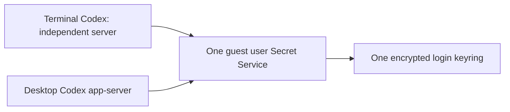

# Desktop guest authentication: issue #480 research

Implementation entrypoint:
[`issue-480-desktop-auth-implementation.md`](issue-480-desktop-auth-implementation.md).
That guide consolidates the current decisions; this file retains evidence and
experimental detail.

Research date: 2026-09-15. Repository: `f166413`. Locally inspected CLI:
`codex-cli 0.154.0`; upstream source inspected at `rust-v0.154.0`.

Status: a real-process guest-side prototype is implemented in
[`tests/test-codex-desktop-prototype.py`](../../tests/test-codex-desktop-prototype.py).
It does not yet implement the coop command or persistent guest service. The
recommended design is one shared user keyring with separate Codex app-servers.
No real account login, desktop connection, or VM lifecycle test was run.
#481's production code is unchanged; its server isolation has also been tested
against the proposed shared-keyring arrangement.

## Recommended architecture

Use the ordinary per-user Secret Service architecture: **one GNOME Keyring
daemon, one encrypted store, multiple application clients**. Keep terminal
Codex's explicit configuration override so it continues using its own server.
Sharing the credential service does not require sharing the Codex app-server.



This is an established problem area, not a new storage abstraction to invent.
The same concurrent-daemon concern was raised on
[GNOME Discourse in 2020](https://discourse.gnome.org/t/are-concurrent-gnome-keyring-daemon-processes-safe-to-run/3601).
That thread has no technical answer; it establishes precedent only. The design
is supported by the [Secret Service architecture](https://specifications.freedesktop.org/secret-service/latest/ch01.html),
GNOME's [PAM integration](https://wiki.gnome.org/Projects/GnomeKeyring/Pam), and
the real-process comparisons below.

| Approach | Assessment |
| --- | --- |
| One user keyring, separate Codex servers | Recommended. Coherent storage and a shared login without giving up #481's server isolation. |
| Multiple keyring daemons writing one directory | Rejected. Reproduced stale reads and resurrection after an unrelated write. |
| Separate desktop and terminal credential directories | Avoids the file conflict but introduces unnecessary separate login state. |
| Share the desktop app-server with terminal Codex | Outside this design; preserve #481's explicit no-reuse behavior. |
| Implement GNOME's private unlock protocol | Unnecessary. Its packaged PAM module already implements that operation. |

**Headless unlock can use PAM without restarting the keyring.** A dedicated
keyring-only PAM service can obtain a password through an explicit helper's
conversation callback and pass it to `pam_gnome_keyring.so`. The module talks
to the running daemon through its existing control socket. This is the same
mechanism GNOME uses at login; coop need not implement its private protocol.
It does not require changing SSH authentication or setting a Linux account
password to match the keyring password.

The isolated proof uses `pam_exec.so expose_authtok /usr/bin/true` to collect
the PAM authentication token, followed by `auth required pam_gnome_keyring.so`
without `auto_start`. `/usr/bin/true` emits nothing. This is a prototype PAM
stack, not a proposed replacement for the machine's login stack. The production
helper still needs TTY handling, first-use confirmation, bounded operations,
secret-memory cleanup, and post-unlock collection/write checks.
Guest provisioning must also account for package installation effects:
Ubuntu's `libpam-gnome-keyring` post-install script runs `pam-auth-update`, and
its default profile adds a password-management hook. Installing the module is
not equivalent to leaving the global PAM configuration unchanged. Audit that
profile explicitly; the unlock helper must use its dedicated PAM service.

Why this works: the GNOME module reads `PAM_AUTHTOK` and performs an unlock
operation on the existing daemon. A bare `gnome-keyring-daemon --unlock` takes
a different startup path. `--start --unlock` is explicitly incompatible in
46.1, so combining those CLI flags is not a fix. Sources:
[GNOME PAM module, 46.1](https://github.com/GNOME/gnome-keyring/blob/46.1/pam/gkr-pam-module.c),
[daemon option handling, 46.1](https://github.com/GNOME/gnome-keyring/blob/46.1/daemon/gkd-main.c),
[Linux-PAM token collection, 1.5.3](https://github.com/linux-pam/linux-pam/blob/v1.5.3/modules/pam_exec/pam_exec.c).

## Local prototype results

Run on Ubuntu 24.04, GNOME Keyring 46.1, and native Codex 0.154.0. The fixture
owns private D-Bus/keyring processes, temporary credential storage, and native
daemon lifecycle operations. It uses disposable values only; no model task or
real account authentication occurs. The following observations narrow the
implementation requirements:

- An explicitly supplied bus address reaches the native daemon. The launch
  command exits; a subsequent native start attaches to the same process.
  After a server crash, a new native start with that environment reconnects.
- WebSocket JSON-RPC over the native Unix control socket can store an invalid,
  disposable API key in the configured keyring, read account state after client
  disconnect and server replacement, and log out. No `auth.json` is created.
  This exercises persistence, not API-key validity or ChatGPT OAuth.
- Concurrent native starts produce one `started` and one `alreadyRunning`
  result at the same socket. Native start from a different bus still reuses
  the first server; readiness does not verify authentication-session identity.
- Missing default aliases and locked collections are separately observable.
  A wrong password leaves the collection locked. Replacing the owned keyring
  process with the correct password restores access to encrypted data.
- Repeated standalone `--unlock` calls against a running service returned
  success while leaving it locked and created competing daemon candidates.
  During investigation, a candidate took the bus name after the original
  daemon exited. The fixture therefore permits `--unlock` only to create its
  foreground child and retires that child before trying again. It also disables
  automatic service activation on its private bus. For intentional maintenance,
  retire the associated app-server before replacing its keyring. Unexpected
  service failures follow the user-triggered recovery contract below.
- On this private bus, native app-server readiness can succeed with a locked
  keyring, while credential persistence fails. Do not turn every locked-keyring
  failure into a server-start timeout diagnostic.
- A deliberately stalled temporary server binary demonstrates that a native
  readiness failure leaves process state requiring explicit cleanup. The test
  verifies process termination with a Linux PID file descriptor, not just
  removal of the daemon's record.
- **Shared backing files are not coherent across separate keyring daemons.**
  A second daemon continued returning the old disposable token after the first
  refreshed and deleted it; a later **unrelated item write** from the stale
  daemon resurrected the deleted credential in a fresh session. This was not
  simply an explicit re-login to the deleted account.
- **One service fixes that storage inconsistency.** Independent `secret-tool`
  processes immediately observed changes and deletion; an unrelated write did
  not resurrect the deleted item, including after the service was restarted.
- Both `secret-tool` and native Codex worked with `DBUS_SESSION_BUS_ADDRESS`
  and `GNOME_KEYRING_CONTROL` absent from the client environment. They discovered
  the shared bus through `XDG_RUNTIME_DIR/bus`. The test supplies an isolated
  runtime directory; PAM/systemd must supply the ordinary directory in guests.
- The existing terminal wrapper can use the same keyring as the desktop daemon
  while keeping its embedded server. `strace` verified no desktop control-socket
  connection; removing only #481's explicit override made it attach.
- The PAM proof created the missing login collection, rejected a wrong password,
  and unlocked the existing collection with the correct password. **The same
  keyring PID retained the D-Bus name throughout.** The short-lived PAM helper
  exited without terminating the service. No host PAM configuration was changed.
- An existing empty-password login collection can become unlocked and pass
  write/read checks while storing the disposable value literally in its file.
  Collection identity, `Locked=false`, and successful writes do not prove
  encryption. This must be checked before accepting an existing store.
- Native Codex retained its in-memory API-key account after another CLI process
  logged out of the shared store. A server restart observed the deletion.
  Shared storage therefore does not imply immediate cross-process cache
  invalidation. This is an API-key characterization, not an OAuth refresh test.

Run the prototype on Linux with a native Codex installation:

```bash
sudo apt-get install python3-dbus python3-websocket dbus gnome-keyring libsecret-tools strace
COOP_TEST_CODEX="$(command -v codex)" python3 tests/test-codex-desktop-prototype.py -v
```

These are opt-in characterization tests for the inspected versions, not CI
coverage of a completed feature. Several assertions intentionally pin upstream
limitations and should be revisited when those limitations change. The package
symlink is created only under the temporary home; the installed package is not
modified. The stalled-server test replaces only that temporary symlink.
The existing #481 real-daemon regression also passes with Codex 0.154.0.
Validation: all fifteen prototype tests passed, including the optional PAM
test. The three original #481 tests passed in the preceding prototype run.
Changing the prototype's credential-store configuration to `file` deliberately
failed the login persistence assertion; restoring `keyring` passed. This checks
for plaintext immediately after login, before logout could hide the file.
An adversarial review also found that the original lookup helper treated bus
failures as missing credentials. It now requires a healthy unlocked collection
and an empty Secret Service search before accepting a failed lookup as absence.
The unavailable-bus regression passes; restoring the old helper makes it fail.
Replacing the plaintext fixture's startup with nonempty-password initialization
also makes its plaintext assertion fail, distinguishing encrypted storage from
an unlocked, writable collection.

To include the PAM proof on a disposable Linux guest:

```bash
sudo apt-get install libpam0g-dev libpam-gnome-keyring
cc -Wall -Wextra -Werror tests/codex-keyring-pam-probe.c -lpam -o /tmp/coop-keyring-pam-probe
COOP_TEST_CODEX="$(command -v codex)" \
COOP_TEST_PAM_PROBE=/tmp/coop-keyring-pam-probe \
python3 tests/test-codex-desktop-prototype.py -v
```

The local investigation extracted the PAM package into a temporary directory
instead of installing it into the host's authentication stack. The optional
`COOP_TEST_PAM_MODULE` selects that extracted module. Tests use
`pam_start_confdir` with a temporary configuration directory. Replacing the
GNOME module with `pam_permit.so` produced PAM success but failed the collection
assertion, confirming that the proof tests the actual unlock, not an exit code.

## Conclusion

### Follow-up: real systemd ownership and storage adoption

Tested locally on the same Ubuntu 24.04 host using a disposable Linux user,
its ordinary systemd user manager, and fresh public-key SSH connections to the
existing local SSH server. The test enabled lingering, added the packaged
`gnome-keyring-daemon.service` to `default.target`, and started its packaged
socket/service. It used a private PAM configuration, without changing global
PAM. The disposable user, lingering setting, runtime services, SSH key, and
home were removed afterward.

Observed results:

- Noninteractive SSH supplied `/run/user/<uid>` as `XDG_RUNTIME_DIR`.
- PAM created an encrypted login collection without changing the service PID.
  Independent `secret-tool` processes stored and read a disposable value with
  `DBUS_SESSION_BUS_ADDRESS` and `GNOME_KEYRING_CONTROL` removed.
- After all SSH sessions exited, `loginctl` reported zero sessions while the
  user manager remained active. A new SSH connection found the same unlocked
  keyring PID.
- Killing the keyring service's main process caused systemd to replace it with
  a locked service. PAM unlock restored access to the persisted value.
- Stopping and starting the user manager brought up the keyring through the
  headless target, locked again. Another unlock restored the value. This is a
  user-manager restart test, not a VM reboot test.

A separate isolated-daemon experiment checked storage adoption against actual
GNOME 46.1 files. The binary format begins with `GnomeKeyring\n\r\0\n`
and four zero bytes identifying its supported version/algorithms. That prefix
identifies an **encrypted-format candidate**, not file integrity. See the
[versioned binary reader](https://github.com/GNOME/gnome-keyring/blob/46.1/pkcs11/secret-store/gkm-secret-binary.c)
and [plaintext format](https://github.com/GNOME/gnome-keyring/blob/46.1/pkcs11/secret-store/gkm-secret-textual.c).

| Existing file | Fresh daemon result | Adoption result |
| --- | --- | --- |
| Valid encrypted store | Login collection locked | Correct-password PAM unlock succeeds. |
| Plaintext store | Login collection present | Rejected by format check before PAM or writes. |
| Unknown format | Login collection missing | Rejected; existing file must not be treated as first use. |
| Truncated binary with valid prefix | Login collection missing | Rejected; prefix alone is insufficient. |
| Unsupported binary version | Login collection missing | Rejected before PAM. |
| Damaged ciphertext with valid prefix | Login collection locked | PAM unlock fails; collection stays locked. |

All six existing files remained byte-for-byte unchanged by these checks.
The adoption sequence is therefore: classify format, require the fresh daemon
to load an existing collection, then unlock through PAM and verify the intended
collection. Only a genuinely absent store may enter first-use initialization.
Do not try PAM creation to repair a file the daemon failed to load. A damaged
ciphertext and an incorrect password are not distinguishable from this unlock
result; report failure without inventing the cause.

Initial adoption must validate through a fresh service generation; an already
unlocked daemon can hold cached state that says nothing about a subsequently
damaged file. This experiment is not a general integrity validator for an
already-unlocked store. Production adoption checks and their error states still
need implementation. The remaining external gates are actual desktop/native
updater behavior, real OAuth concurrency, and the two VM backends.

Prefer the standard user bus over a desktop-specific bus. Native launches can
then discover the same service from their normal login environment; coop does
not need to inject the environment of another process into a desktop daemon.
The first gate should remain **unlock → desktop connects → terminal exits →
desktop reconnects**, followed immediately by a server-crash reconnect.

The user will run the branch on macOS/Lima and Linux/Firecracker after it is
pushed. Implement toward this standard service arrangement, and treat those
tests as required acceptance gates before claiming desktop support. Native
bootstrap/updater behavior and failed-start cleanup still need verification in
the actual desktop command sequence.

## What is established

### Existing coop behavior

- [#480](https://github.com/trailofbits/coop/issues/480) records successful SSH
  connection and failed guest OAuth persistence. Its missing collection and
  stalled startup observations are separate failure states.
- [#481](https://github.com/trailofbits/coop/issues/481)'s fix is present in
  `scripts/guest/codex-account.sh`: terminal launches explicitly pass
  `-c 'cli_auth_credentials_store="keyring"'`. Preserve that server-isolation
  override. The proposed change replaces per-terminal keyring sessions with
  the managed user service; it does not restore terminal app-server reuse.
- The wrapper already prompts without echo, rejects empty passwords, confirms
  first-use passwords, and probes a disposable write. Its `*.keyring` existence
  check does not verify the live login collection or default alias. Its error
  classification is insufficient for the desktop service.
- Native installation is already implemented in `scripts/guest/codex.sh`.
  Existing disks still need migration; a golden-image rebuild alone does not
  update an existing VM. See `docs/codex-integration.md`.

### Native Codex lifecycle, version 0.154.0

The installed CLI exposes `app-server daemon start`, `restart`, `stop`,
`version`, `bootstrap`, and `app-server proxy [--sock PATH]`.

Source inspection establishes:

| Interface | Behavior relevant to coop |
| --- | --- |
| `daemon start` | Uses the native managed binary, not an arbitrary PATH wrapper. Returns JSON after a control-socket initialize probe. Reuses a responding socket without checking its D-Bus session. |
| Detached launch | Inherits the launching process environment; Unix launch uses `setsid` and redirects standard streams. No explicit environment-file option appears in CLI help. |
| `daemon restart` | Starts the replacement from the restart caller's environment. An ordinary SSH restart could therefore lose the managed bus address. |
| `daemon bootstrap` | Stops an existing managed server, starts another, and starts/replaces a detached updater. It is not an idempotent attach operation. |
| Native serialization | Lifecycle mutations take a per-`CODEX_HOME` operation lock; process publication has additional reservation locking and process-start identity checks. |
| Readiness failures | Nominal readiness deadline is 10 seconds; operation-lock deadline is 75 seconds. `start` and `bootstrap` propagate readiness errors without a corresponding rollback in those paths. An outer timeout alone does not clean up detached children. |
| `daemon stop` | Stops the app-server; the inspected path does not also stop the bootstrap updater. |

Sources: upstream [daemon implementation](https://github.com/openai/codex/blob/rust-v0.154.0/codex-rs/app-server-daemon/src/lib.rs),
[process launch](https://github.com/openai/codex/blob/rust-v0.154.0/codex-rs/app-server-daemon/src/backend/pid_start.rs),
[managed binary resolution](https://github.com/openai/codex/blob/rust-v0.154.0/codex-rs/app-server-daemon/src/managed_install.rs),
and [daemon lifecycle contract](https://github.com/openai/codex/blob/rust-v0.154.0/codex-rs/app-server-daemon/README.md).
These interfaces are experimental; verify the same assumptions after upgrades.

Consequences:

- Prefer `start` for the first experiment. Determine whether the desktop uses
  `start`, `bootstrap`, `restart`, or another launch path on each connection.
- A successful `start` is not evidence that the server uses the intended bus.
  Verify session identity and credential persistence separately.
- A launcher-only environment assignment is insufficient if later SSH commands
  or an existing updater can replace the server outside that environment.
- Do not assume native bootstrap installs a systemd service. The inspected
  implementation uses detached PID-managed processes and an updater.

## Proposed guest service

One authentication service per guest UID, used by terminal and desktop clients:

- Use the normal user bus at `/run/user/<uid>/bus`, managed by systemd, and the
  packaged GNOME Keyring service/control socket. GNOME already ships a
  [foreground service unit](https://github.com/GNOME/gnome-keyring/blob/46.1/daemon/gnome-keyring-daemon.service.in).
  Ubuntu's installed unit differs in its install target, so explicitly arrange
  headless startup instead of assuming a graphical-session target will run.
- Enable lingering for the guest user so the user manager survives the last
  SSH logout. This is systemd's supported mechanism for long-running user
  services ([systemd 255 documentation](https://github.com/systemd/systemd/blob/v255/man/loginctl.xml)).
  The keyring starts locked after reboot; lingering does not retain its password.
- Let ordinary SSH login sessions discover the standard bus. Verify that
  `pam_systemd` supplies `XDG_RUNTIME_DIR` in both guest images, including
  noninteractive SSH. Do not import another process's environment.
- Make the terminal wrapper check/unlock this service, retaining the explicit
  keyring configuration override. It must not launch another private keyring
  against the same files. Nested terminal invocations use the same service.
- Keep Codex's native daemon commands responsible for server PID/socket
  ownership. Coop owns authentication readiness and recovery. Avoid a second
  competing app-server PID manager; audit the native updater separately.
- An app-server started while the keyring was locked may cache missing auth.
  After an unlock transition, recover that server through the native restart
  interface. Repeated unlock may be a no-op only after encryption, collection
  readiness, and the recorded service generation have all been verified.
  Bus/keyring failures need explicit server recovery, not just a readiness flag.
- No persistent password, plaintext auth fallback, or host credential copy.
  Keep the existing managed `~/.codex` credential-store policy.

Upgrade guest support in place where possible, then restart the VM to retire
old per-terminal keyring daemons before enabling the singleton. The existing
encrypted collection and Codex home can remain in place; separate desktop
credentials or a new keyring password are not inherent requirements.

### Recovery ownership after coop exits

The proposed first implementation uses **user-triggered recovery**. Systemd
owns the bus and keyring lifetime; `coop codex unlock` owns the serialized
readiness check and native server recovery while that command runs. No coop
process remains to retire a native server automatically after a keyring crash.
An already running Codex client may retain cached credentials during that gap.

Record a non-secret service generation in the guest runtime directory: boot ID,
D-Bus server ID, and the keyring's unique bus owner. On each unlock operation,
compare it with the last successfully recovered generation. A change or missing
record requires native server recovery even if another client already unlocked
the replacement keyring. Publish the new record only after the collection probe
and native recovery succeed; retry after failure must not take the no-op path.
Use Codex's lifecycle lock through its native commands, not direct PID control.

After a bus/keyring failure, the documented action is to rerun unlock and then
reconnect the desktop. Automatic retirement is not part of this contract.
Desktop-owned starts and the updater do not take coop's lock, so their races
with this recovery remain an explicit acceptance gate. If native interfaces
cannot provide bounded recovery in that sequence, this design is not ready to
ship; a successful local keyring probe is insufficient.

### Interactive unlock contract

`coop codex unlock <vm>` is a proposed spelling, not an existing command. The
current CLI accepts a VM name at that position; preserve existing parsing and
consider the ambiguity of a VM named `unlock` before choosing the public syntax.

Serialize create/unlock/start as one coop operation. Read the password on the
guest TTY; pass it through stdin or a private pipe, never argv, an environment
variable, a temporary file, or logs. Clear in-process references promptly.

Start or verify the packaged user service, then use the dedicated PAM helper
to create/unlock its login collection. Supply its control directory from the
known user runtime path. Leave `auto_start` out of the PAM stack so the helper
does not acquire daemon lifetime ownership. Inspect the collection before
attempting a write that could invoke a graphical prompt. Neither PAM success
nor process exit status alone establishes that the collection is ready.

Before prompting, writing a probe, or taking an already-unlocked shortcut,
verify that an existing login store uses the supported encrypted GNOME format.
Reject plaintext and unrecognized formats with a distinct diagnostic. The
Secret Service API has no portable at-rest encryption property; the production
implementation needs a version-tested GNOME storage check, not an inference
from the collection name, `Locked`, file permissions, or PAM success. Creating
a new collection requires a confirmed nonempty password and the same encryption
check afterward. The prototype characterizes this gap; it does not yet implement
the production format check. Do not overwrite or silently convert an existing
plaintext/unknown store. Require explicit migration to a new encrypted
collection and reauthentication before enabling managed desktop use.

After initialization, resolve `ReadAlias("default")`, verify the target object
exists and is the intended persistent login collection, then check its `Locked`
property. `/` means the alias is absent. Create a unique disposable non-secret
item, read it back, and delete it. Report cleanup failure. Do not silently
accept a session-only collection or redirect an unrelated existing default.
See the [Secret Service API](https://specifications.freedesktop.org/secret-service/latest-single/).

Return distinct states: collection missing/uninitialized; collection locked;
service unavailable; invalid/dangling default alias; write or cleanup failed;
unencrypted/unsupported store; startup busy; server ownership conflict;
server readiness timeout. A failed
probe alone does not prove the password was wrong. Bound noninteractive D-Bus
calls, lock acquisition, startup, and rollback separately. Prompt cancellation
must also release ownership and clean up newly started processes.

### Remaining Codex cache and refresh behavior

One keyring daemon fixes divergent keyring-file state. It does not invalidate
credentials already copied into a running application's memory. The API-key
probe above demonstrates that distinction. Do not promise immediate global
logout or immediate account switching across all running Codex processes.

Codex 0.154.0's `AuthManager` caches credentials, reloads the active store before
its guarded ChatGPT refresh, skips refresh if another writer already changed
the stored credentials, and rejects the guarded refresh if the account no
longer matches. Its refresh semaphore is process-local; these guards do not
establish an atomic transaction across independent Codex servers.
See [the versioned auth manager](https://github.com/openai/codex/blob/rust-v0.154.0/codex-rs/login/src/auth/manager.rs).

Real ChatGPT concurrent refresh, logout/relogin, and account switching remain
acceptance tests. Restart affected clients after externally changing login
state when their cache does not update. If simultaneous OAuth refresh exposes
a remaining race, reproduce it at Codex's shared-store boundary and address it
there; do not introduce a custom OAuth broker or duplicate login stores as a
premature workaround. A keyring lock also cannot erase secrets clients already
hold in memory; VM reboot does terminate those guest processes.

## Prototype procedure and decision gate

Use a disposable supported guest and record guest OS, GNOME Keyring version,
CLI version, desktop build, and native-install layout.

1. Establish the standard user bus/keyring service and initialize/unlock its encrypted
   login collection. Verify the default alias and disposable item lifecycle.
2. Launch native `daemon start` through an ordinary fresh SSH session. Preserve
   the usual user-bus and Codex home/socket discovery. Record bounded, non-secret readiness
   results and the service identity, not credentials or full environments.
3. Connect through the actual desktop app. Observe its launch commands using
   narrowly scoped, non-secret instrumentation in the disposable guest. Prove
   which daemon and Secret Service instance handle the connection.
4. Complete browser login and a real guest task. Close the unlock terminal,
   disconnect the desktop, then reconnect and run another task.
5. Crash just the server and reconnect. Check that any replacement inherits the
   same session. Repeat with simultaneous connection attempts.
6. Reboot. Connection must not bypass the required new unlock or hang on a GUI
   prompt. Unlock again and reconnect using the persisted encrypted credentials.

Pass only if native desktop attachment and all replacement paths reach the
same user service. In particular, test the desktop reconnecting after boot
while the keyring is still locked: coop can provide precise preflight/status
errors, but the desktop's own error presentation must be observed. Retain
failed-start cleanup checks even though bus discovery is simpler. Do not edit
private desktop databases or replace packaged binaries to force attachment.

## Discovery and remaining user steps

`src/workspace.rs::ssh_config_block` writes `Host coop-<name>` directly into
`~/.ssh/config`, including host, port, user, and identity. This matches the
documented discovery input: concrete aliases resolved through OpenSSH.
Discovery compatibility is established by code/documentation inspection;
actual appearance and refresh in the desktop UI remain to be tested.
See [official SSH connection setup](https://learn.chatgpt.com/docs/remote-connections#connect-to-an-ssh-host).

After authentication support is proven, document this sequence:

1. Start the VM and run `coop ssh-config <vm>` on the desktop machine.
2. Verify `ssh coop-<name>` works and `codex` is on the remote login-shell PATH.
3. Run the eventual explicit unlock operation.
4. In Settings → Connections, add or enable the discovered SSH host and select
   `/workspace` or the intended guest project directory.
5. Complete guest Codex authentication and verify a task runs in the guest.

Desktop account sign-in, SSH authentication, guest keyring unlock, guest Codex
login, and project selection are distinct steps. No supported SSH-project
registration CLI/deep link was established in the documentation inspected.
Existing coop code refreshes managed SSH configuration on lifecycle operations
and removes its own blocks on destroy; verify desktop behavior for changed Lima
ports, recreation, repeated setup, app absence, and stale saved connections.

## API-key and proxy mode: separate investigation

Desktop API-key support in general does not establish remote proxy compatibility.
The ordinary desktop SSH connection bypasses coop's per-session environment
assembly. `src/commands/lifecycle.rs` supplies the proxy capability token as the
configured provider's environment key; `src/workspace.rs`'s alias does not supply
that token. Raw API-key forwarding also must not be assumed to happen here.

Test how a persistent daemon receives and refreshes the intended provider
credential, including proxy restart/token rotation and model-mode switches.
Check desktop startup/discovery calls against the proxy route allowlist
(`docs/credential-proxy.md`). Keep ChatGPT auth and `[proxy.openai]` mutually
exclusive. Do not forward a new secret or persist the capability token merely
to make the desktop launch work without a separate design decision.

## Required validation after the prototype

| Case | Required observation |
| --- | --- |
| Fresh login | Browser and device-code login each persist credentials in the intended encrypted collection; no fallback auth file. |
| Terminal closes / desktop reconnects | Session survives; server attaches correctly; real remote task completes. |
| Server crash | Replacement uses the owned session, with one socket owner. |
| Bus/keyring crash | Next unlock detects the changed service generation and recovers the native server; reconnect succeeds. Record actual desktop behavior before that explicit recovery. |
| Existing plaintext/unknown keyring | Refused before the already-unlocked shortcut or any credential/probe write; no silent conversion. |
| VM restart | Runtime ownership resets; explicit unlock is required; encrypted login survives. |
| Logout/relogin and token refresh | No stale resurrection or lost writes; test CLI and desktop in both orders. |
| Simultaneous CLI/desktop | #481 isolation remains; test concurrent refresh and writes to backing storage. |
| Duplicate connections/unlocks | One lifecycle owner; bounded waits; no duplicate keyring/server/updater. |
| Failed starts/cancel/wrong password | Preserve failure reason; clean up newly owned processes, sockets, and probe items; retry succeeds. |
| Existing wrong-session server | Reject or deliberately replace under ownership; never report ready based solely on socket response. |
| Bootstrap/update/restart | Every replacement retains the intended environment and lifetime ownership. |
| Stop/destroy/recreate | No owned runtime processes survive; handle stale desktop connections without deleting unrelated configuration. |

Run desktop-to-Lima end to end and backend-shared authentication/lifecycle
integration on Firecracker. Validate new tripwires by removing the promised
behavior. The local prototype covers only the process-level observations above;
both platform suites, interactive TTY handling, real ChatGPT login/refresh, and
actual desktop connection/reconnection remain unrun.
